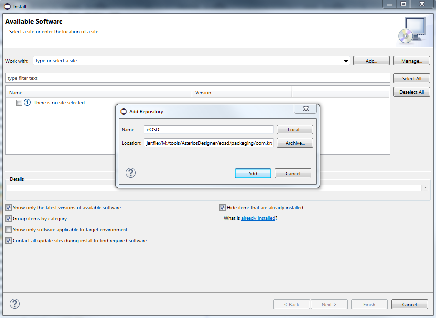
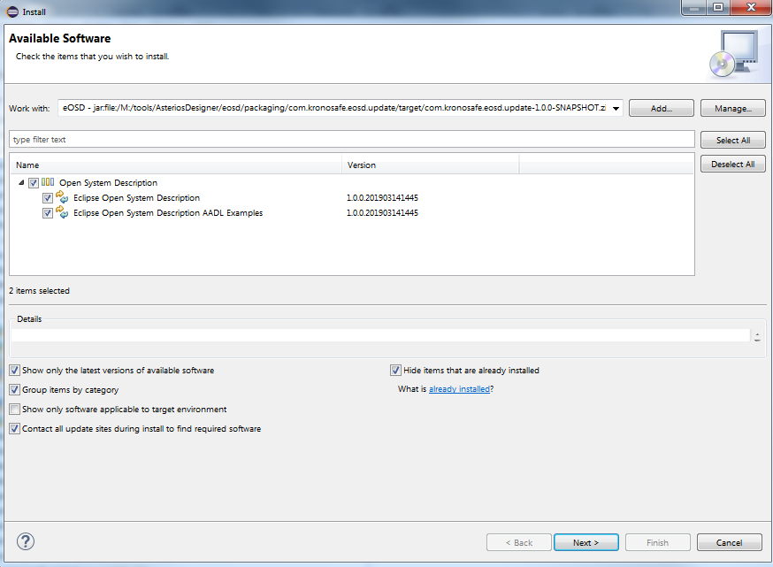
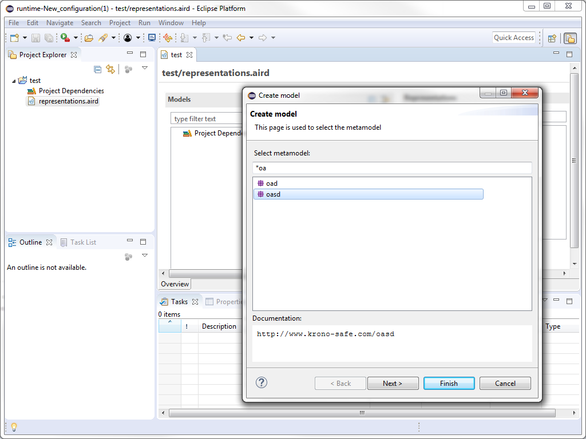

[Website](http://www.krono-safe.com) • [Twitter](https://twitter.com/KRONO_SAFE)

## All-in-one Open System Description
Eclipse OSD is the implementation of the Open System Description format with the Eclipse Modeling Framework. An ecore metatmodel is provided with a tree editor and a graphical sirius editor.

## Setup

### Pre-requisites

For development, you need to manually install the following components:

|                         Tools                         |                              Description                               |
| ----------------------------------------------------- | :--------------------------------------------------------------------- |
| `Eclipse IDE 2018.12`                         | The  Eclipse IDE Modeling Project. The tool is available [here](https://www.eclipse.org/downloads/download.php?file=/technology/epp/downloads/release/2018-12/R/eclipse-modeling-2018-12-R-win32-x86_64.zip) |
| `Eclipse RCPTT runner`                         		| The Eclipse RCPTT testing framework [here](http://www.eclipse.org/downloads/download.php?file=/rcptt/release/2.3.0/ide/rcptt.ide-2.3.0-win32.win32.x86_64.zip) |
| `ATL`                         						| The ATL Transformation Language used for the AADL2OSD Transformation available as an Eclipse Update Site [ATL Releases P2 Repository] [here](http://download.eclipse.org/mmt/atl/updates/releases) |
| `OSATE`                         						| Bundle for the AADL transformation example [here](https://osate-build.sei.cmu.edu/download/osate/stable/2.3.7/products/) |

The resulting update site compatibility are:

|                         Tools                         |                              Description                               |
| ----------------------------------------------------- | :--------------------------------------------------------------------- |
| `Eclipse Photon Modeling Tools 4.8.0`                              | The Eclipse Modeling package [here](https://www.eclipse.org/downloads/download.php?file=/technology/epp/downloads/release/photon/R/eclipse-modeling-photon-R-win32-x86_64.zip) |
| `Eclipse 2018-12 Modeling Tools 4.10.0`                                 | The Eclipse Modeling package [here](https://www.eclipse.org/downloads/download.php?file=/technology/epp/downloads/release/2018-12/R/eclipse-modeling-2018-12-R-win32-x86_64.zip) |

The resulting update site dependencies are:

|                         Tools                         |                              Description                               |
| ----------------------------------------------------- | :--------------------------------------------------------------------- |
| `Eclipse EMF`                                         | EMF Runtime 2.14.0 or EMF Runtime 2.16.0                               |
| `ATL (Optional: uses for the examples)`                         				| The ATL Transformation Language used for the AADL2OSD Transformation available as an Eclipse Update Site [ATL Releases P2 Repository] [here](http://download.eclipse.org/mmt/atl/updates/releases) |
| `OSATE (Optional: uses for the examples)`                         			| Bundle for the AADL transformation example [here](https://osate-build.sei.cmu.edu/download/osate/stable/2.3.6/products/) |
 
## Obtaining the eOSD feature
You have two options to obtain the eOSD feature

### Option 1: Build the eOSD

- mvn -f releng/com.kronosafe.eosd.parent/pom.xml clean verify

### Option 2: Download the eOSD featuregit

- download the eOSD feature from the releases in github
  - no need to unzip it

## How To use it
To install eOSD plugin on the Eclipse IDE:

- open Eclipse IDE (eclipse.exe)
- Help -> Install new Software
- Click on Add, then Archive and give a name of your repository: eOSD

  

- The Open System Description category should appear

  

- Install the Open System Description feature

- Create a new modeling project
- In the editor of the project you can create a model with new and filtering on "oasd" or "oad" models

  

## How to change the version numbers

- cd releng/com.kronosafe.eosd.parent
- mvn org.eclipse.tycho:tycho-versions-plugin:set-version -DnewVersion=2.0.0-SNAPSHOT
- Open the pom.xml and change the common.parent version dependency to 2.0.0-SNAPSHOT
- cd releng/com.kronosafe.eosd.common.parent
- Open the pom.xml and change the version to 2.0.0-SNAPSHOT

## How to launch Eclipse Integration Tests

- mvn -f tests/com.kronosafe.osd.tests.rcptt/pom.xml clean test

If you want to use the RCPTT IDE, select the tests as the workspace and import the project com.kronosafe.osd.tests.rcptt. Choose, the aut and then change the workspace to the desktop (aut -> right click -> configure).

## How to use the AADL2OSD Transformation

- Readme is provided in the example
